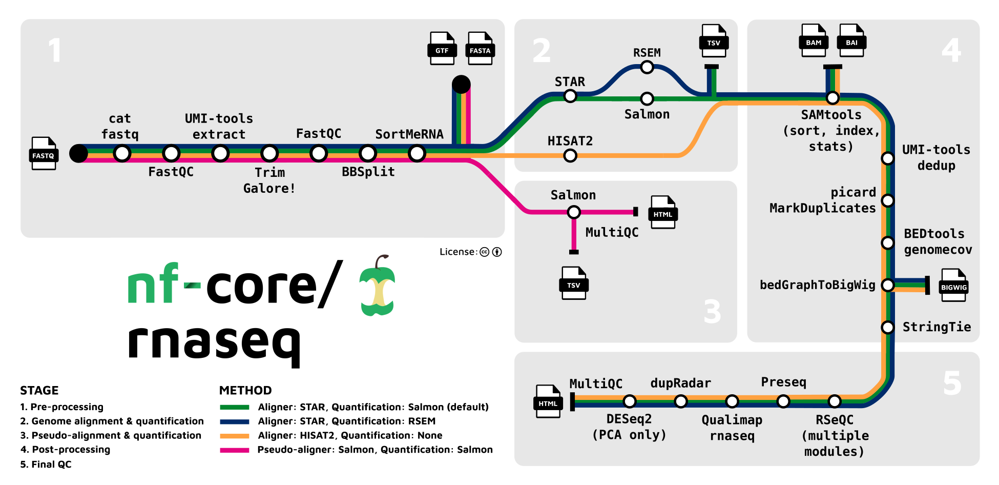

<head>
<script src="https://kit.fontawesome.com/ece750edd7.js" crossorigin="anonymous"></script>
</head>

```{r setup, include=FALSE}
knitr::opts_chunk$set(echo = TRUE)
```

<br>
<div class="objectives">
<h2><i class="far fa-check-square"></i>Learning Objectives</h2>
 * Understand the benefits of using a workflow system such as nextflow
 * Build and run a custom nextflow workflow
 * Explore the nf-core collection of custom nextflow workflows
 * Run the nf-core RNA-Seq workflow and view the results
</div>
<br>

----

## 1. Workflow management systems

In the previous session we went through an RNA-Seq analysis pipeline, covering pre-processing, QC, alignment to a reference genome, and transcript quantification. At the end of the session we pulled all of the commands together into a script called *pipeline.sh*, which allows you to run the analysis using a single command.

In this session we will explore [nextflow](https://nextflow.io/), a dedicated workflow management system, which provides a wide range of useful features that would require additional effort to implement using shell scripts.  These include:

- **Ability to orchestrate processes:** In *pipeline.sh* we had to use GNU parallel to tell our system to run commands in parallel. This is not necessary when we use a tool such as *nextflow*, which has the ability to work out how to run the analysis steps most efficiently on a given platform 
- **Re-entrancy:** By default, whenever you run *pipeline.sh* it will run all of the commands in the pipeline from scratch. This can extremely inefficient if you only need to re-run one of the later steps. Tools such as *nextflow* can work out which steps need to be re-run, and skip the others
- **Flexibility:** Tools such as *nextflow* provide many options for specifying parameters, and for managing the software used in the individual steps, making it easier to re-use the pipeline for different analyses, or on different platforms

<br>
<div class="discussion">
<h2><i class="far fa-bell"></i> Discussion</h2>
How could you achieve re-entrancy using scripts? What are the potential challenges and risks of doing this?
</div>
<br>

----

## 2. How nextflow works

*nextflow* provides a high level domain specific language (DSL), built on top of the programming language [groovy](https://groovy-lang.org/), which allows you to specify workflows using an intuitive, high level syntax that abstracts away much of the low level plumbing that you would have to take care of using scripts. There are actually two versions of the *nextflow* DSL, which work slightly different. Modern *nextflow* pipelines use the new version, referred to as *DSL2*. Pipelines written using *nextflow* are executed using the *nextflow* workflow engine, which orchestrates and runs the pipeline steps.

*nextflow* uses the *dataflow programming* paradigm, in which individual steps (referred to as *processes*) are connected to each other using *channels*, and data flows between the processes through the channels. This is a powerful concept, and is used in a number of other contexts, for example:

- In *bash* scripts, programs can be connected together using *pipes*. The data output by the first program flows into the input of the next through the pipes
- In spreadsheets, formulas are often used to calculate the value in one cell based on the value in another. When the value in a cell is updated, the data in the cell flows through to all of the cells that reference it, and they also update their values

<br>
<div class="key-points">
<h2><i class="fas fa-thumbtack"></i> Key points:</h2>
##
 * Specialised workflow tools such as nextflow provide a simple way of specifying pipelines, and provide a wide range of useful features
 * Nextflow is a powerful and popular workflow tool that uses a dataflow model, where analysis steps are specified as individual processes that are connected using channels
</div>
<br>

----

## 3. Using nextflow

In this section we will demonstrate how to install *nextflow*, and how to build and run a simple *nextflow* workflow.

### Installing nextflow

*nextflow* can be installed on any POSIX compatible system, such as Linux or Mac OS, or on Windows using [WSL](https://docs.microsoft.com/en-us/windows/wsl/about). *Nextflow* is already installed on the WCB servers, but if you would like to install it on another system *nextflow* provides a command line installer, which can be run using the following command:

```bash
$ curl -fsSL get.nextflow.io | bash
```

*Note: You will need a recent version of [Java](https://www.java.com) to be installed on your system before running this command.*

Alternatively, if you have [conda](https://conda.io/projects/conda/en/latest/) installed you can also use it to install *nextflow* along with its dependencies into a conda environment.

<br>
<div class="resources">
<h2><i class="fas fa-book"></i> Further Learning</h2>
A detailed guide on how to install and get started with nextflow can be found [here](https://www.nextflow.io/docs/latest/getstarted.html).
</div>
<br>

----

### Writing nextflow scripts

In this section we will look at a toy *nextflow* pipeline that illustrates some of the basic concepts of *nextflow*, in particular how the processes and channels that make up the workflow are specified, how parameters are handled, and how to run the pipeline and understand the output.

The following script, which I've called *simple-pipeline.nf* takes a collection of input files, each with the prefix *input_*, and performs two steps:

- Capitalise the string, and save it to a file ending in *.caps.txt*
- Reverse the capitalised string, and save it to a file ending in *.rev.caps.txt*

```groovy

#!/usr/bin/env nextflow

// We need to specify that we're using DSL2 here
nextflow.enable.dsl=2

// These are the default values for the parameters, which can be accessed from inside the 
// process blocks. Globs can be used in these definitions to specify multiple files.
params.in = "*.txt"
params.publishDir = "results"

/*
 * The following process blocks define the pipeline steps
 */

// Capitalise the text in the input file
process CAPITALISE {

    // This directive tells nextflow to publish the files generated by this process that match the
    // specified pattern to params.publishDir.
    // It also contains a 'saveAs' parameter, which uses the groovy replaceAll method to perform a
    // regex substitution on the output file names. This can be useful to avoid name conflicts.
    publishDir (
        path: "${params.publishDir}",
        pattern: "*.caps.txt",
        saveAs: { filename -> filename.replaceAll(/.txt.caps.txt$/, ".caps.txt") },
        mode: 'copy'
    )

    // This is where tell nextflow the type if data that we expect in the input channel, and
    // which name we want to use for it
    input:
    path x

    // This tells nextflow that we only want to put paths whose names match the glob "*.caps.txt"
    // into the output channel
    output:
    path "*.caps.txt"

    // This is the shell block, where we put the actual command to run.
    // When we use a shell directive we can use both nextflow parameters and shell variables.
    // nextflow parameters are specified using the !{x} syntax, and shell variables (not used here)
    // would use $x.
    shell:
    """
    cat !{x} | tr '[:lower:]' '[:upper:]' > !{x}.caps.txt 
    """
}

// Reverse the text in the input file
process REVERSE {
 
    publishDir (
        path: "${params.publishDir}",
        pattern: "*.rev.txt",
	    saveAs: {
			filename -> filename.replaceAll(/.txt.caps.txt.rev.txt$/, ".caps.rev.txt")
	    },
        mode: 'copy'
    )

    input:
    path x
 
    output:
    path "*.rev.txt"

    shell:
    """
    cat !{x} | rev > !{x}.rev.txt 
    """
}

/*
 * The following workflow block defines how to link the processes together with channels
 */
workflow {

	// first we define a channel called input_ch
    input_ch = Channel.fromPath(params.in)
	
	// then we define a channel called caps_ch as the output channel of the CAPITALISE process, 
	// with input_ch its input channel 
    caps_ch = CAPITALISE(input_ch)
    
	// then we call the REVERSE process, with caps_ch as its input channel
	REVERSE(caps_ch)
    
}

```

<br>
<div class="challenge">
<h2><i class="fas fa-pencil-alt"></i> Challenge:</h2>
How would you change the script so that it generates the reverse of the original input files rather than the capitalised files?
<details>
<summary>
Solution
</summary>
<div class="solution">
<h2><i class="far fa-eye"></i></h2>
Replace	*REVERSE(caps_ch)* with *REVERSE(input_ch)* in the workflow block, and update saveAs in the publishDir directive for the REVERSE process.
</div>
</details>
</div>
<br>

----

### Running nextflow scripts

You can run a *nextflow* script using the *nextflow run* command:

```bash

[USERNAME]@bifx-core3:~/RNA-seq_workshop$ mkdir nextflow_example; cd nextflow_example
[USERNAME]@bifx-core3:~/RNA-seq_workshop/nextflow_example$ echo one > one.txt
[USERNAME]@bifx-core3:~/RNA-seq_workshop/nextflow_example$ echo two > two.txt
[USERNAME]@bifx-core3:~/RNA-seq_workshop/nextflow_example$ cat >> simple-pipeline.nf

<paste the pipeline code shown above here, then type Ctrl+D>

[USERNAME]@bifx-core3:~/RNA-seq_workshop/nextflow_example$ nextflow run simple-pipeline.nf

N E X T F L O W  ~  version 21.10.6
Launching `simple-pipeline.nf` [jovial_gates] - revision: 601a9c8121
executor >  local (4)
[0a/bac795] process > CAPITALISE (2) [100%] 2 of 2 ✔
[f5/620bae] process > REVERSE (2)    [100%] 2 of 2 ✔

[USERNAME]@bifx-core3:~/RNA-seq_workshop/nextflow_example$ head results/*

==> results/one.caps.txt <==
ONE

==> results/one.caps.rev.txt <==
ENO

==> results/two.caps.txt <==
TWO

==> results/two.caps.rev.txt <==
OWT

[USERNAME]@bifx-core3:~/RNA-seq_workshop/nextflow_example$

```

You can also override the default parameters using command line options with the names of the parameters, as follows:

```bash
[USERNAME]@bifx-core3:~/RNA-seq_workshop/nextflow_example$ rm -r ./results
[USERNAME]@bifx-core3:~/RNA-seq_workshop/nextflow_example$ nextflow run simple-pipeline.nf --in one.txt

N E X T F L O W  ~  version 21.10.6
Launching `simple-pipeline.nf` [awesome_meitner] - revision: 601a9c8121
executor >  local (2)
[ee/1526ca] process > CAPITALISE (1) [100%] 1 of 1 ✔
[57/22dbd1] process > REVERSE (1)    [100%] 1 of 1 ✔

[USERNAME]@bifx-core3:~/RNA-seq_workshop/nextflow_example$ head results/*


==> results/one.caps.txt <==
ONE

==> results/one.caps.rev.txt <==
ENO

[USERNAME]@bifx-core3:~/RNA-seq_workshop/nextflow_example$
```

In the above example the default value for *params.in*, "*.txt", was replaced by "one.txt", causing only that input file to be processed.

----

### Resuming nextflow scripts

One of the most useful features of workflow tools such as *nextflow* is re-entrancy, which allows you to resume an incomplete pipeline rather than having to re-run it from scratch. *nextflow* allows you to do this using the *-resume* flag. In the following example I will modify *simple-pipeline.nf* to create a broken pipeline in which the REVERSE process fails. Running this workflow will result in incomplete output. I will then fix the broken pipeline, and use the *-resume* flag to resume it without re-running the CAPITALISE process:

```bash
[USERNAME]@bifx-core3:~/RNA-seq_workshop/nextflow_example$ sed 's/ rev / broken_rev /' simple-pipeline.nf > broken-pipeline.nf  # this effectively breaks the rev command, resulting in a pipeline that will fail

[USERNAME]@bifx-core3:~/RNA-seq_workshop/nextflow_example$ nextflow run broken-pipeline.nf

N E X T F L O W  ~  version 21.10.6
Launching `broken-pipeline.nf` [determined_miescher] - revision: 01340331bc
executor >  local (4)
[f3/db9f35] process > CAPITALISE (2) [100%] 2 of 2 ✔
[f1/c46e02] process > REVERSE (2)    [  0%] 0 of 2
executor >  local (4)
[f3/db9f35] process > CAPITALISE (2) [100%] 2 of 2 ✔
[f1/c46e02] process > REVERSE (2)    [100%] 1 of 1, failed: 1
Error executing process > 'REVERSE (1)'

Caused by:
  Process `REVERSE (1)` terminated with an error exit status (127)

Command executed:

  cat two.txt.caps.txt | broken_rev > two.txt.caps.txt.rev.txt

Command exit status:
  127

Command output:
  (empty)

Command error:
  .command.sh: line 2: broken_rev: command not found

Work dir:
  work/5e/7807d71da3f91caca9699667291c84

Tip: you can try to figure out whats wrong by changing to the process work dir and showing the script file named `.command.sh`

[USERNAME]@bifx-core3:~/RNA-seq_workshop/nextflow_example$ sed --in-place 's/ broken_rev / rev /' broken-pipeline.nf  # this fixes the rev command in broken-pipeline.nf

[USERNAME]@bifx-core3:~/RNA-seq_workshop/nextflow_example$ nextflow run broken-pipeline.nf -resume

N E X T F L O W  ~  version 21.10.6
Launching `broken-pipeline.nf` [soggy_shaw] - revision: 601a9c8121
executor >  local (2)
[f3/db9f35] process > CAPITALISE (1) [100%] 2 of 2, cached: 2 ✔
[e5/5494dc] process > REVERSE (1)    [100%] 2 of 2 ✔

[USERNAME]@bifx-core3:~/RNA-seq_workshop/nextflow_example$ rm broken-pipeline.nf
[USERNAME]@bifx-core3:~/RNA-seq_workshop/nextflow_example$ 
```

In the above, example, fixing the pipeline and specifying the *-resume* flag resulted in the pipeline using the existing outputs of the CAPITALISE process cached in the work directory, as indicated by *cached: 2* in the output log.

----

### Understanding the output of nextflow workflows

Now that we have run our *nextflow* pipeline, we can view the results using the *tree* command.

```bash
[USERNAME]@bifx-core3:~/RNA-seq_workshop/nextflow_example$ tree -a

.
├── .nextflow
│   ├── cache
│   │   └── 4be8d787-a695-4ad3-81a2-031be0e01dd2
│   │       ├── db
│   │       │   ├── 000005.sst
│   │       │   ├── 000010.log
│   │       │   ├── CURRENT
│   │       │   ├── LOCK
│   │       │   └── MANIFEST-000009
│   │       └── index.soggy_shaw
│   ├── history
│   ├── .nextflow
│   └── plr
├── .nextflow.log
├── one.txt
├── results
│   ├── one.caps.rev.txt
│   ├── one.caps.txt
│   ├── two.caps.rev.txt
│   └── two.caps.txt
├── simple-pipeline.nf
├── two.txt
└── work
    ├── 11
    │   └── 10334377a00b5c93e955a0ea18df6f
    │       ├── .command.begin
    │       ├── .command.err
    │       ├── .command.log
    │       ├── .command.out
    │       ├── .command.run
    │       ├── .command.sh
    │       ├── .exitcode
    │       ├── one.txt -> ../../../one.txt
    │       └── one.txt.caps.txt
    ├── 58
    │   └── 1280a821d821576e6fa3ff699feefb
    │       ├── .command.begin
    │       ├── .command.err
    │       ├── .command.log
    │       ├── .command.out
    │       ├── .command.run
    │       ├── .command.sh
    │       ├── .exitcode
    │       ├── one.txt.caps.txt -> ../../11/10334377a00b5c93e955a0ea18df6f/one.txt.caps.txt
    │       └── one.txt.caps.txt.rev.txt
    ├── 9e
    │   └── b7c925ff9caa0b1b0f274b2683e1e3
    │       ├── .command.begin
    │       ├── .command.err
    │       ├── .command.log
    │       ├── .command.out
    │       ├── .command.run
    │       ├── .command.sh
    │       ├── .exitcode
    │       ├── two.txt -> ../../../two.txt
    │       └── two.txt.caps.txt
    └── ce
        └── 3449bf6fc1bb467fba1284916f4f9d
            ├── .command.begin
            ├── .command.err
            ├── .command.log
            ├── .command.out
            ├── .command.run
            ├── .command.sh
            ├── .exitcode
            ├── two.txt.caps.txt -> ../../9e/b7c925ff9caa0b1b0f274b2683e1e3/two.txt.caps.txt
            └── two.txt.caps.txt.rev.txt
```

In the above output we can see the following:

- Our *simple-pipeline.nf* nextflow script
- Our input files, *one.txt* and *two.txt*
- The *results* directory, which contains the published results
- The *work* directory, which contains a subdirectory for each process
- The *.nextflow.log* file, and the *.nextflow* directory, which are used to store the history of past runs of the pipeline, and ensure that a pipeline run cannot be started again while a previous run is in progress

By creating a specialised directory for each process, *nextflow* isolates the outputs of the different processes, and reduces the risk of name conflicts. Each process directory within the *work* directory includes the following:

- The output files generated by the process
- Symbolic links to the input files for the process
- The shell script that was run as part of the process, in *.command.sh*
- A log of the exit code of the command if it failed, in *.exitcode*
- A log of the standard output and standard error of the commands that were run (in *.command.log* and *.command.err* respectively
- Some internal shell code required for the shell script to run successfully on different platforms (in *.command.run*)

Many of these files can be useful for debugging broken scripts.  The presence of the *work* directory is also useful for tidying up, since if the required results have been published to an output directory (using *mode: 'copy'* in the *publishDir* directive), it can be deleted to save space.

<br>
<div class="challenge">
<h2><i class="fas fa-pencil-alt"></i> Challenge:</h2>
Can you work out which subdirectory of *work* corresponds to which process?
<details>
<summary>
Solution
</summary>
<div class="solution">
<h2><i class="far fa-eye"></i></h2>
There are a few ways to do this. You could list the commands that were run in each directory as follows:

```bash
[USERNAME]@bifx-core3:~/RNA-seq_workshop/nextflow_example$ find work -name .command.sh -exec bash -c "echo {}': '; cat {}" \; 
```

You could also use *nextflow log*, specifying the name of the run:

```bash
[USERNAME]@bifx-core3:~/RNA-seq_workshop/nextflow_example$ nextflow log soggy_shaw -f process,workdir
```
</div>
</details>
</div>
<br>

<div class="resources">
<h2><i class="fas fa-book"></i> Further Learning</h2>
Nextflow is a complex and feature rich workflow language, and we have only provided a brief introduction here. For a more in depth introduction to nextflow, see [this course](https://ggrimes.github.io/workflows-nextflow/). To see an example of a simple but more realistic RNA-Seq pipeline, look at the docs [here](https://nextflow.io/example4.html).
</div>
<br>

<div class="key-points">
<h2><i class="fas fa-thumbtack"></i> Key points:</h2>
##
 * Nextflow can be installed on POSIX based systems, or Windows with WSL, via the command line installer, or via conda
 * Nextflow workflows are written in a high level domain specific language, containing *process* blocks that specify different processes, and a *workflow* block where you specify how to connect the processes together
 * Nextflow pipelines provide a number of options for specifying parameters, and provide support for re-entrancy using the *-resume* flag
</div>
<br>

----

## 4. The nf-core RNA-Seq pipeline

One of the easiest ways to perform an NGS analysis is to use a pre-existing pipeline. A good example of a high quality, flexible, and well maintained pre-built *nextflow* pipeline for RNA-Seq analysis is provided by [nf-core](https://nf-co.re/). 

This pipeline can be configured to run a wide range of tools, including many of those we used in the previous session. The range of possible workflows that the *nf-core* pipeline covers is shown in the following image, taken from the [nf-core pipeline documentation](https://nf-co.re/rnaseq):



----

### Running the pipeline

We can view the help text for the *nf-core* RNA-Seq pipeline as follows:

```bash
$ nextflow run -r 3.8.1 nf-core/rnaseq --help

N E X T F L O W  ~  version 21.10.6
Launching `nf-core/rnaseq` [special_babbage] - revision: 89bf536ce4 [3.8.1]


------------------------------------------------------
                                        ,--./,-.
        ___     __   __   __   ___     /,-._.--~'
  |\ | |__  __ /  ` /  \ |__) |__         }  {
  | \| |       \__, \__/ |  \ |___     \`-._,-`-,
                                        `._,._,'
  nf-core/rnaseq v3.8.1
------------------------------------------------------
Typical pipeline command:

  nextflow run nf-core/rnaseq --input samplesheet.csv --outdir <OUTDIR> --genome GRCh37 -profile docker

Input/output options
  --input                      [string]  Path to comma-separated file containing information about the samples in the experiment.
  --outdir                     [string]  The output directory where the results will be saved. You have to use absolute paths to storage on Cloud
                                         infrastructure.
  --email                      [string]  Email address for completion summary.
  --multiqc_title              [string]  MultiQC report title. Printed as page header, used for filename if not otherwise specified.
  --save_merged_fastq          [boolean] Save FastQ files after merging re-sequenced libraries in the results directory.
  ...
```

The help text tells us that we need to create a samplesheet in csv format. Full instructions on how to build a samplesheet are provided [here](https://nf-co.re/rnaseq/3.8.1/usage). The samplesheet for the example analysis that we are using looks like this:

```csv
sample,fastq_1,fastq_2,strandedness
Control_1,Control_1.fq.gz,,reverse
Control_2,Control_2.fq.gz,,reverse
Control_3,Control_3.fq.gz,,reverse
MOV10_OE_1,MOV10_OE_1.fq.gz,,reverse
MOV10_OE_2,MOV10_OE_2.fq.gz,,reverse
MOV10_OE_3,MOV10_OE_3.fq.gz,,reverse
```

In order to run the *nf-core* RNA-Seq workflow, we need to specify the following:

- The samplesheet, as shown above
- The output directory, where the results of the analysis will be saved
- The *profile* that we would like to use. This determines how the pipeline will find and the software used to perform the analysis. The best practice recommendation is to use *singularity* or *Docker* containers, however *conda* is also supported. In each case the selected tool must be installed prior to running the pipeline
- the locations of the relevant reference files, or the genome to be used if you would like to use iGenomes hosted online
- A specification of the pipeline steps you would like to run

As an example, we can run the pseudo-alignment steps of the pipeline, corresponding to the pink route in the image above. We will use the annotation files from the previous session.

```bash
[USERNAME]@bifx-core3:~/RNA-seq_workshop/nextflow_example$ cd ..
[USERNAME]@bifx-core3:~/RNA-seq_workshop$ mkdir nfcore_rnaseq_example; cd nfcore_rnaseq_example
[USERNAME]@bifx-core3:~/RNA-seq_workshop/nfcore_rnaseq_example$ ln -s ../annotation
[USERNAME]@bifx-core3:~/RNA-seq_workshop/nfcore_rnaseq_example$ ls ../fastq/*.fq.gz | xargs -I {} ln -s {}
[USERNAME]@bifx-core3:~/RNA-seq_workshop/nfcore_rnaseq_example$ cat >> samplesheet.csv
sample,fastq_1,fastq_2,strandedness
Control_1,Control_1.fq.gz,,reverse
Control_2,Control_2.fq.gz,,reverse
Control_3,Control_3.fq.gz,,reverse
MOV10_OE_1,MOV10_OE_1.fq.gz,,reverse
MOV10_OE_2,MOV10_OE_2.fq.gz,,reverse
MOV10_OE_3,MOV10_OE_3.fq.gz,,reverse
<Ctrl+D>
[USERNAME]@bifx-core3:~/RNA-seq_workshop/nfcore_rnaseq_example$ nextflow run -r 3.8.1 nf-core/rnaseq -profile singularity --outdir nfcore_rnaseq_pseudoalignment --input samplesheet.csv --skip_alignment --pseudo_aligner salmon --salmon_index annotation/hg38.cdna.ncrna.salmon.index/ --fasta annotation/Homo_sapiens.GRCh38.dna.primary_assembly.fa --gtf annotation/Homo_sapiens.GRCh38.106.gtf

N E X T F L O W  ~  version 21.10.6
Launching `nf-core/rnaseq` [curious_mercator] - revision: 89bf536ce4 [3.8.1]


------------------------------------------------------
                                        ,--./,-.
        ___     __   __   __   ___     /,-._.--~'
  |\ | |__  __ /  ` /  \ |__) |__         }  {
  | \| |       \__, \__/ |  \ |___     \`-._,-`-,
                                        `._,._,'
  nf-core/rnaseq v3.8.1
------------------------------------------------------
...

```

This command uses the *skip_alignment* parameter along with the *pseudo_aligner salmon* option to tell nextflow to run pseudo-alignment only. A complete guide to the available parameters for the pipeline can be found [here](https://nf-co.re/rnaseq/3.8.1/parameters).

As was the case for the example *nextflow* pipeline discussed in the previous section, the pipeline generates a *work* directory containing the working directories for the processes, and publishes the results of the analysis to the directory specified using the *outdir* parameter (in our case *nfcore_rnaseq_pseudoalignment*).

Once complete, you can view the output in the output directory `nfcore_rnaseq_pseudoalignment`, including a **MultiQC** summary of all of the tools we have run.

You can view a MultiQC report from the full size dataset [here](https://bifx-core3.bio.ed.ac.uk/training/RNA-seq_analysis/nextflow_full/results_ensembl/multiqc/star_salmon/multiqc_report.html).

<br>
<div class="key-points">
<h2><i class="fas fa-thumbtack"></i> Key points:</h2>
##
 * nf-core provides a curated collection of high quality NGS analysis pipelines 
 * The nf-core RNA-Seq pipeline covers preprocessing, alignment, quantification and QC, but not differential expression analysis
 * By setting the many parameters of the pipeline in different ways, it is possible to use it to perform a range of different analyses
</div>
<br>
